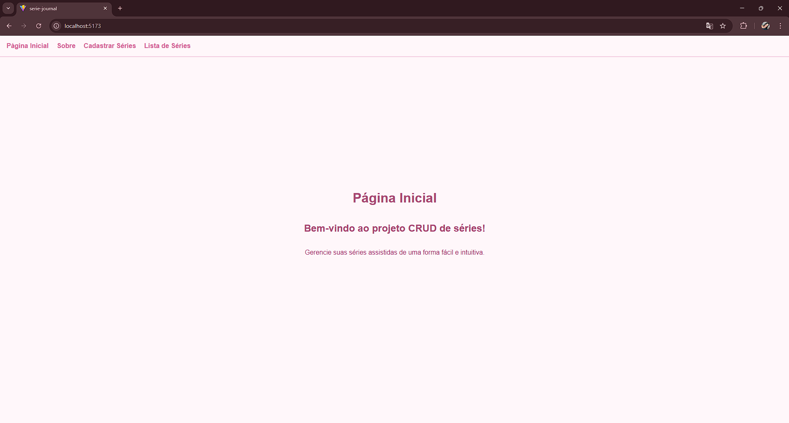
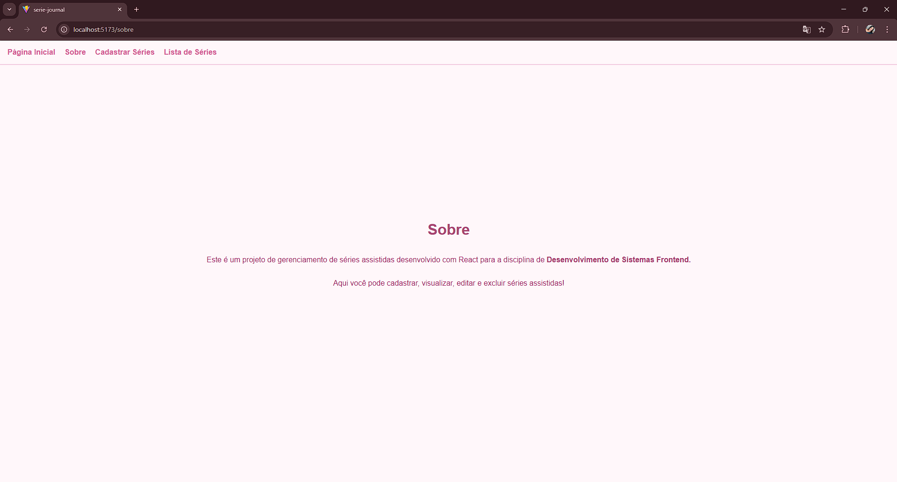
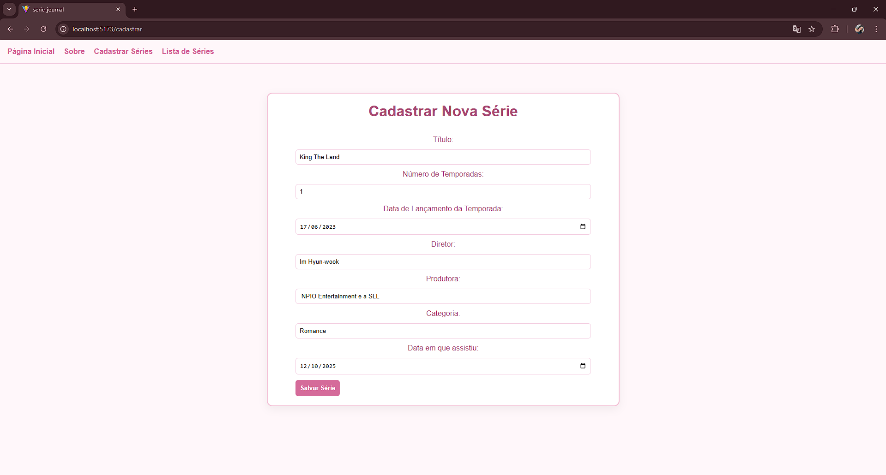
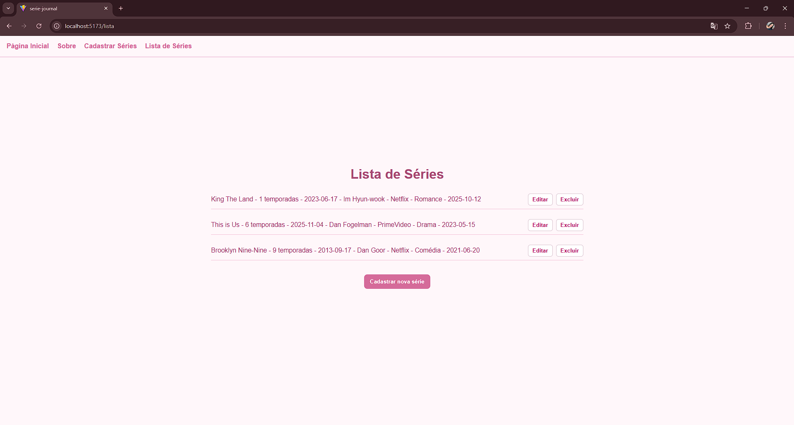

# Serie Journal (Fase 1) — Natalia Prestes Santos Pontes

## Descrição
**Serie Journal** é um CRUD frontend (React + Vite) para gerenciar séries assistidas.  
Versão Fase 1: frontend estático, com criação, listagem, edição local e remoção de séries. O estado é mantido em memória (ex.: `useState`) — persistência local via `localStorage` pode ser adicionada/ativada conforme necessidade.

Projeto desenvolvido para a disciplina **Desenvolvimento de Sistemas Frontend** (Aulas 1–5).

---

## Funcionalidades implementadas
- Página inicial (Home) com mensagem de boas-vindas.
- Página "Sobre" com breve descrição do projeto.
- Página "Cadastrar" com formulário para adicionar/editar séries.
- Página "Lista" com visualização das séries em formato de linha (um item por linha) e botões **Editar** / **Excluir** à direita.
- Ao clicar **Editar**, o formulário é preenchido com os dados da série e permite atualizar.
- Validação básica (campos controlados) e limpeza do formulário após salvar.
- Identidade visual suave (tema rosa pastel) mantendo simplicidade.

## Screenshots do Projeto

### Página Inicial


### Sobre


### Cadastrar Séries


### Lista de Séries


---

## Campos do formulário (conforme enunciado)
- Título
- Número de Temporadas
- Data de Lançamento da Temporada
- Diretor
- Produtora
- Categoria
- Data em que assistiu

---

## Estrutura do projeto

```
serie-journal/
├── public/
├── src/
│   ├── components/
│   │   ├── NavBar/        # menu de navegação
│   │   ├── SerieForm/     # formulário de cadastro/edição
│   │   └── SerieList/     # listagem das séries
│   ├── pages/
│   │   ├── Home.jsx
│   │   ├── Sobre.jsx
│   │   ├── Cadastrar.jsx
│   │   └── Lista.jsx
│   ├── data/
│   │   └── sampleSeries.js
│   ├── App.jsx
│   ├── main.jsx
│   └── index.css
├── .gitignore
├── package.json
└── README.md
```


## Como executar (passo a passo)

### Pré-requisitos
- Node.js (versão 16+ recomendada)
- npm (vem com Node.js)

### Comandos
1. Abra um terminal na pasta do projeto (`serie-journal`).
2. Instale dependências:
npm install
3. Rode o servidor de desenvolvimento:
npm run dev
4. Abra no navegador o endereço mostrado no terminal (ex.: http://localhost:5173).

